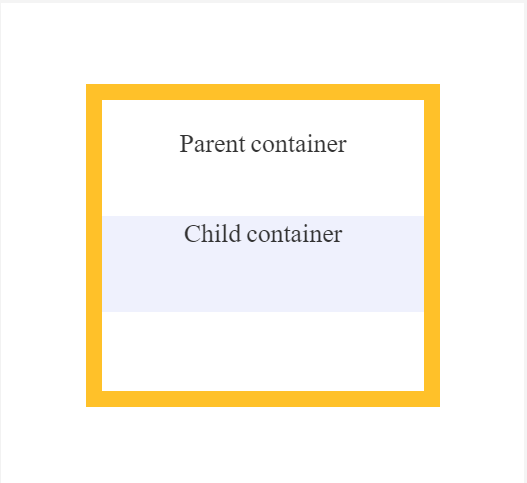

# Lists in HTML


### How many numbers of lists are on HTML?

- There are three types of lists in HTML

1. Ordered lists: ordered lists in HTML used to create a list of items and all item inside it has number, example:

```
<ol>
  <li>Coffee</li>
  <li>Tea</li>
  <li>Milk</li>
</ol> 
```

2. Unordered lists: Like ordered list unordered lists are used to create a list of items but the item inside it has not number, example:

- #### The result will be like this

1. Coffee
2. Tea
3. Milk

```
<ul>
  <li>Coffee</li>
  <li>Tea</li>
  <li>Milk</li>
</ul>  
```

#### The result will be like this

- Coffee
- Tea
- Milk

3. Definition lists: definition lists in HTML are used to create a list of items and each item inside it has description, example:

```
<dl>
  <dt>Coffee</dt>
  <dd>Black hot drink</dd>
  <dt>Milk</dt>
  <dd>White cold drink</dd>
</dl>
```

#### The result will be like this

<pre>
Coffee
    Black hot drink <br />
Milk
    White cold drink
</pre>

# Boxes in CSS


- box-sizing for example:

```
box-sizing: content-box;
width: 100%;
```

#### The result will be like this



#### Margin and padding in CSS: in margin is the space around an element’s border, padding is the space between an element’s border and the element’s content


#### hidden and visible elements in CSS: it is a way to show or hidden elements in CSS for example:-

```
p {
  visibility: visible;
}


p {
  visibility: hidden;
}
```

- The first example will show the paragraph to user on web page.

- The secound example will hidden the paragraph to user on web page

# JavaScript Arrays and Decisions  and Loops

- ### JavaScript Arrays


> #### (w3schools website) JavaScript arrays are used to store multiple values in a single variable for example:-

```
<script>
<p id="demo"></p>
const drinks = ["Coffee", "Tea", "Milk"];
document.getElementById("demo").innerHTML = drinks;
</script>
```

#### The result will be like this

<pre>
 Coffee,Tea,Milk
</pre>

- ### JavaScript Decisions


> #### (w3schools website) Use the if statement to specify a block of JavaScript code to be executed if a condition is true for example:-

```
if (money < 100) {
  message = "You do not have enough money";
}
```

#### If a condition is true the result will be like this

<pre>
You do not have enough money
</pre>

#### Use the switch statement to select one of many code blocks to be executed for example:-

```
<script>
let drink = prompt('Please enter your fav drink');
switch (drink) {
  case 0:
    day = "Coffee";
    break;
  case 1:
    day = "Tea";
    break;
  case 2:
    day = "Milk";
    break;
}
document.write(drink);
</script>

```

#### If he/she enters Coffee the result will be like this

<pre>
Coffee
</pre>

#### If he/she enters Tea the result will be like this

<pre>
Tea
</pre>

#### If he/she enters Milk the result will be like this

<pre>
Milk
</pre>

- ### JavaScript loops


#### JavaScript loops is a big topic if you interesting in this thing I advise you to visit the w3schools website to learn more about loops in JavaScript

[JavaScript Loops on the w3schools website](https://www.w3schools.com/js/js_loop_for.asp)
