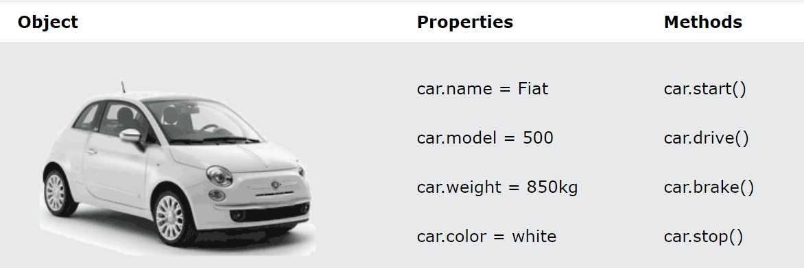

# Problem Domain, Objects, and the DOM

## **Problem Domain**

### What is Problem Domain meaning

> In short, let's say that it is the problems and difficulties that programmers face while writing the code.

### to understand the problem domain and if we want to make programming easier we can do one of two things:

1. Make the problem domain easier.

2. Get better at understanding the problem domain.

## **Objects in JS**

### What is an object in programming ?

Everything in life is an object, for example, a human is an object a computer is an object and a car is an object every object has properties and actions, in a JavaScript object is a block of code that has properties and actions.

> (w3schools.com) for example A car has properties like weight and color, and methods like start and stop:

- All cars have the same properties, but the property values differ from car to car.

## **Objects in Document Object Model**

 abbreviated with (DOM) is a programming API for HTML documents. It defines the logical structure of documents and the way a document is accessed and manipulated.

 With the object model, JavaScript gets all the power it needs to create dynamic HTML:

 - JavaScript can change all the HTML attributes in the web page.

- JavaScript can remove existing HTML elements and attributes.

- JavaScript can react to all existing HTML events in the page.

- JavaScript can change all the HTML elements in the web page.

- JavaScript can change all the CSS styles in the web page.

- JavaScript can add new HTML elements and attributes.

- JavaScript can create new HTML events in the web page.

[If you want to learn more about DOM visit MDN Web Docs by clicking here](https://developer.mozilla.org/en-US/docs/Web/API/Document_Object_Model/Introduction)
