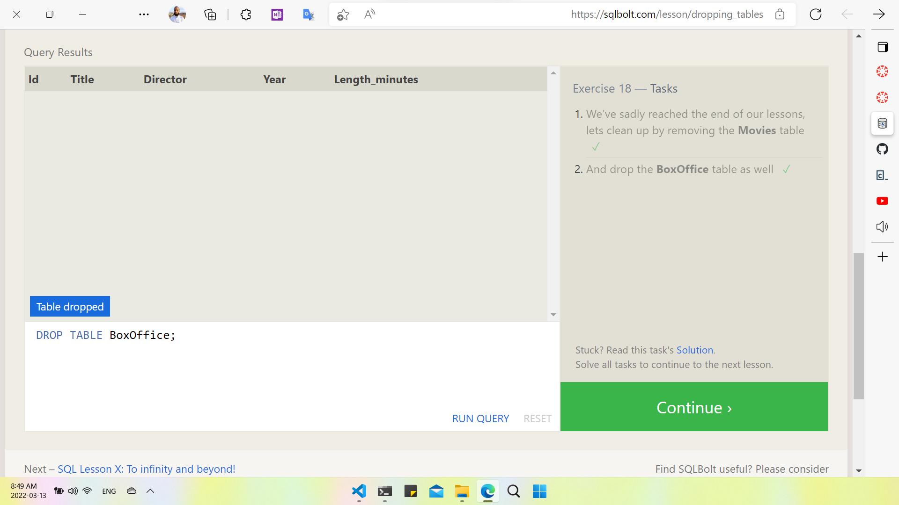

- What is a Database?
A database is a set of data stored in a computer. This data is usually structured in a way that makes the data easily accessible.

- What is a Relational Database?
A relational database is a type of database. It uses a structure that allows us to identify and access data in relation to another piece of data in the database. Often, data in a relational database is organized into tables.

- Tables: Rows and Columns
Tables can have hundreds, thousands, sometimes even millions of rows of data. These rows are often called records.

###### Tables can also have many columns of data. Columns are labeled with a descriptive name (say, age for example) and have a specific data type.

